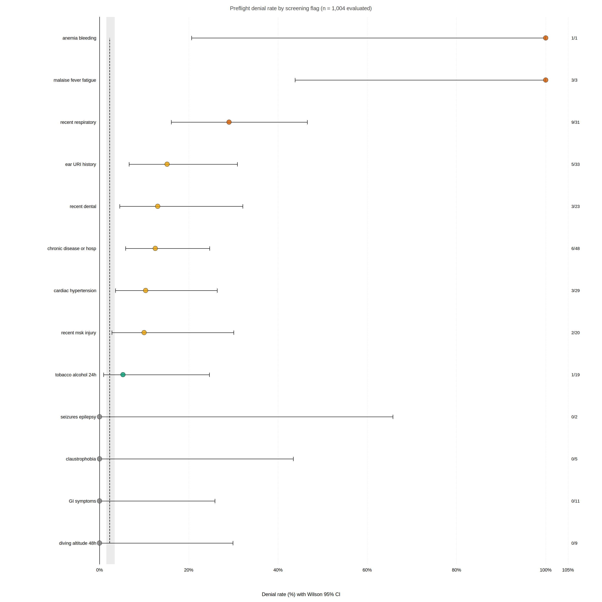
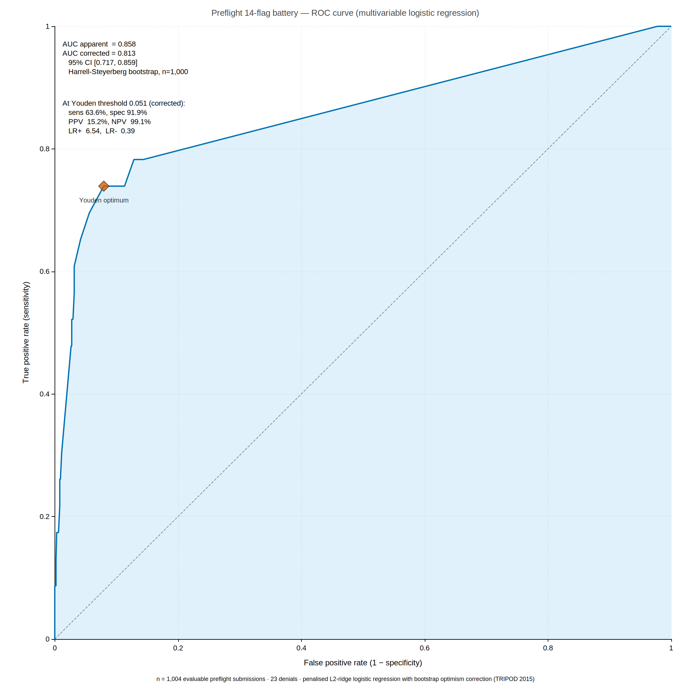

# Screening performance and surveillance yield of a digital preflight medical instrument for military hypobaric-chamber training: a cross-sectional observational study of 1,046 consecutive evaluations

**Authors:** Diego L. Malpica, MD¹

**Affiliations:** ¹ Dirección de Medicina Aeroespacial (DIMAE), Fuerza Aérea Colombiana, Bogotá, Colombia

**Corresponding author:** Diego L. Malpica, MD; dlmalpica@yahoo.com

**Keywords:** hypobaric chamber; ear barotrauma; preflight screening; Eustachian tube dysfunction; aerospace medicine; military aviation; occupational surveillance

**Article type:** Original research (cross-sectional observational study)

**Word count (body):** 3,041 · abstract 248 · references 22 · tables 3 (main) + 1 (supplementary)

---

## What is already known on this topic

- Ear barotrauma affects 1.7–8.5% of military aircrew per hypobaric-chamber exposure; the primary mechanism is failure of active Eustachian tube opening against a trans-tympanic pressure gradient that rises with descent rate and altitude differential.
- Preflight medical screening is the principal operational gate controlling access to chamber sessions, yet no published study has quantified the discriminatory performance of any preflight instrument — flag prevalence, denial rate, or association with downstream events — for any military chamber programme.
- Validated Eustachian-tube dysfunction (ETD) instruments such as the ETDQ-7 detect clinically significant ETD in 30–34% of adults, a prevalence approximately six times higher than that captured by conventional binary yes/no preflight flags.

## What this study adds

- In 1,046 consecutive evaluations over 14 months at a high-altitude military chamber facility, a 14-flag digital preflight instrument operated at a 2.29% overall denial rate (95% CI 1.53–3.41%); 91% of denials concentrated in five flags that together captured only 8.7% of trainees.
- Per-flag univariable odds ratios for denial ranged from 7.2-fold to 28-fold higher for the five active denial flags versus flag-negative trainees; four flags (diving/altitude exposure, gastrointestinal symptoms, claustrophobia, seizure history) were associated with zero denials across all 1,004 evaluable submissions.
- The preflight instrument captured 33% (4/12; 95% CI 14–61%) of in-flight barotrauma events documented by the medical director's run log, establishing the two channels as serving complementary rather than overlapping surveillance functions.

---

## Abstract

**Objectives** To characterise the flag-level prevalence and denial-rate performance of a digital preflight medical-screening instrument for military hypobaric-chamber training, to estimate the univariable association of each screening flag with the reviewing surgeon's denial decision, and to quantify cross-instrument concordance for in-flight barotrauma event capture.

**Design** Cross-sectional observational study with prospective triangulation against medical-director run logs, reported in accordance with the Strengthening the Reporting of Observational Studies in Epidemiology (STROBE) statement.

**Setting** Hypobaric-chamber facility of the Colombian Aerospace Force Dirección de Medicina Aeroespacial (DIMAE), Bogotá, Colombia (2,640 m baseline altitude).

**Participants** All 1,046 consecutive preflight evaluations submitted between 3 February 2025 and 14 April 2026 (1,004 evaluable after exclusion of 42 indeterminate fitness decisions). Companion dataset: 98 medical-director chamber-run logs covering 706 student-exposures over the same period.

**Main outcome measures** Primary: per-flag denial rate (denied/flag-positive evaluable) with Wilson 95% confidence intervals. Secondary: univariable odds ratio (Fisher's exact method) per flag; per-quarter URI-composite flag prevalence; proportion of in-flight barotrauma events captured relative to the medical-director log.

**Results** The overall denial rate was 2.29% (23/1,004; 95% CI 1.53–3.41%). Five flags accounted for 21 of 23 denials: malaise/fever/fatigue (denial rate 100%, 3/3), anaemia/bleeding (100%, 1/1), recent respiratory infection (29.0%, 9/31; OR 28.0, 95% CI 11.0–71.4), ear/URI history (15.2%, 5/33; OR 9.5, 95% CI 3.3–27.3), and recent dental procedure (13.0%, 3/23; OR 7.2, 95% CI 2.0–26.2). Four flags produced zero denials across all flag-positive evaluations. The preflight instrument captured 4 of 12 in-flight barotrauma events documented in the director log (33%; 95% CI 14–61%).

**Conclusions** A 14-flag digital preflight battery for military hypobaric-chamber training concentrates denial-driving signal in five clinically coherent flags with 7- to 28-fold higher denial odds. Four flags serve surveillance only, contributing no denial decisions. The preflight instrument captures one-third of director-logged barotrauma events, establishing that the two channels are complementary. Integration of a validated ETD questionnaire, structured barotrauma grading in the director log, and a de-identifiable trainee linkage key would substantially extend surveillance yield.

---

## Introduction

Ear barotrauma — tympanometric or otoscopic evidence of tympanic membrane injury attributable to a trans-tympanic pressure gradient — is the most common medical sequela of hypobaric-chamber training in military populations, with reported per-exposure incidence ranging from 1.7% to 8.5% across programmes operating at varying baseline altitudes.¹⁻⁴ The mechanism is well characterised: during chamber descent, middle-ear pressure equilibration depends on active Eustachian tube (ET) opening, which fails when the trans-tympanic gradient exceeds the tube's passive-opening threshold — typically 35–50 mmHg — before a swallow or Valsalva manoeuvre can restore equilbrium.⁵ Standard military descent rates of 2,000–5,000 ft·min⁻¹ can generate gradients exceeding this threshold within 60–90 seconds, and programmes based at high-altitude sites face an additional mechanical disadvantage: the resting atmospheric pressure deficit relative to sea level shifts the operating point of every simulated altitude further along the pressure-gradient curve.⁶

Preflight medical screening is the primary gate controlling access to chamber sessions. Its function is to exclude trainees whose current physiological state — active upper respiratory tract infection, Eustachian tube dysfunction, dental abscess, or systemic vulnerability — elevates their per-exposure risk to a level the reviewing flight surgeon judges unacceptable. Despite this gatekeeping role, the internal performance characteristics of preflight instruments are almost entirely unreported: no published study has quantified the flag-level prevalence, per-flag denial rate, or flag–denial association for any military chamber programme. Published research addresses incidence rates and post-hoc risk factors,¹⁻⁴ leaving the upstream performance of the screening gate as an empirical blank.

The Colombian Aerospace Force (FAC) Dirección de Medicina Aeroespacial (DIMAE) operates a hypobaric chamber in Bogotá (2,640 m / 8,530 ft; ambient pressure approximately 561 mmHg). In February 2025, DIMAE migrated its preflight evaluation to a 14-flag digital instrument (Microsoft Forms), creating the first opportunity for an audited, longitudinal record of preflight flag responses and surgeon fitness decisions at a high-altitude military facility. A companion medical-director run log, recording student counts and in-flight events independently of the preflight channel, permitted prospective triangulation of event-capture yield across the two instruments.

A companion paper from the same facility reports the 16-year incidence of ear barotrauma in the full 2010–2026 DIMAE registry.⁷ The present study focuses on the preflight instrument's internal performance rather than on event incidence. The specific objectives were: (i) to characterise per-flag prevalence and the distribution of denial decisions; (ii) to estimate the univariable association of each flag with the flight surgeon's denial decision using exact odds ratios; (iii) to describe the seasonal time-course of URI-spectrum flag prevalence; and (iv) to quantify the fraction of in-flight barotrauma events captured by the preflight instrument relative to the director log.

---

## Methods

### Study design and reporting

We conducted a cross-sectional observational study analysing all consecutive preflight evaluations submitted to the DIMAE digital instrument during a 14-month operational window. The study is reported in accordance with the STROBE statement for cross-sectional studies.⁸ Because this was a secondary analysis of routinely collected operational surveillance data, a prospective registration was not performed; this limitation is noted in the Discussion.

### Setting

The DIMAE chamber facility is located at Bogotá, Colombia (2,640 m; approximate ambient pressure 561 mmHg). The standard chamber profile applied throughout the study window was an ascent at approximately 1,650 ft·min⁻¹ to 25,000 ft (76 mmHg), a 15-minute hypoxia-awareness hold, and a descent at approximately 2,470 ft·min⁻¹ to resting altitude. Sessions enrolled up to 20 trainees per run, each supervised by a DIMAE flight surgeon who reviewed the preflight submissions and was present throughout.

### Data sources

Two institutional data streams were analysed in parallel.

The **preflight evaluation dataset** comprised all 1,046 consecutive digital submissions received between 3 February 2025 and 14 April 2026 via the DIMAE Microsoft Forms instrument. The form collected: submission metadata; trainee demographics (role, rank tier, specialty, aircraft, age-band); training type (INICIAL: first or new-cycle exposure; RECURRENTE: repeat qualification); 14 binary yes/no medical-screening questions, each paired with an optional free-text "Especifique" specification field; a vital-signs block (systolic and diastolic blood pressure, heart rate, peripheral oxygen saturation); physical-examination findings; the reviewing flight surgeon's fitness decision; the denial reason if denied; and an optional free-text field for delayed in-flight events reported by the trainee after the session.

The **medical-director run log** comprised 98 chamber-run records spanning 17 February 2025 to 13 April 2026, covering 706 student-exposures. Each record included: run identification; enrolled student count; a nine-item in-flight event checklist; three emergency-category flags (medical, technical, safety); and Spanish free-text event narratives.

All analyses were performed on de-identified working copies. Raw records containing national identification numbers, full names, institutional email addresses, and mobile telephone numbers were retained behind the DIMAE data-protection boundary and were not transferred externally. Age was aggregated to 5-year bands in all outputs.

### Eligibility and case definitions

All preflight submissions received in the study window were included. Fitness decisions were normalised from heterogeneous string encodings to a three-level factor: *apt*, *denied*, and *indeterminate*. The 42 submissions with indeterminate decisions (entries coded "PENDIENTE", "R", "S", or missing) were excluded from analyses in which denial was the binary outcome, yielding 1,004 evaluable submissions.

For each of the 14 screening flags, a positive response was coded when the yes/no field value equalled "SI" after case-insensitive normalisation. A URI composite variable was derived as the logical union of ear_URI_history, recent_respiratory, and malaise_fever_fatigue.

Vital-sign values outside physiological plausibility bounds (systolic blood pressure 70–220 mmHg; diastolic 40–140 mmHg; heart rate 30–180 beats·min⁻¹; SpO₂ 70–100%) were classified as data-entry artefacts and excluded from the vital-sign descriptive analysis only (n = 8; 0.8% of submissions).

### Statistical analysis

The primary outcome was the per-flag denial rate, defined as the proportion of flag-positive evaluable submissions resulting in a denial decision, reported with Wilson 95% confidence intervals.⁹·¹⁰ Wilson intervals were selected over Clopper-Pearson exact intervals because they maintain better coverage probability at small n and at boundary proportions.¹⁰

Secondary outcomes were: (i) the univariable association of each flag with denial, estimated by the odds ratio and 95% confidence interval from Fisher's exact test, computed using the exact conditional maximum-likelihood method; (ii) per-quarter URI-composite prevalence across five calendar quarters (2025 Q1–Q4 and 2026 Q1) with Wilson 95% CIs; and (iii) the proportion of in-flight barotrauma events captured by the preflight form relative to the medical-director log, with a Wilson 95% CI.

Because 14 flags were evaluated simultaneously, we applied a Bonferroni correction (family-wise α = 0.05/14 = 0.0036) as the threshold for declaring statistical significance. Point estimates and confidence intervals are reported unconditionally for all flags to support clinical interpretation independent of the significance threshold.

A multivariable model summarising the discriminatory performance of the full 14-flag battery was fitted as an additional secondary outcome. With 23 denial events across 14 candidate predictors, the unpenalised events-per-variable ratio (1.6) is below the conventional minimum of 10–20 required for stable maximum-likelihood logistic-regression coefficients,¹¹ and below the events-per-variable heuristic of 10. Recent methodological work has shown that the EPV-of-10 rule of thumb is itself an oversimplification and that out-of-sample predictive performance depends jointly on the sample size, events fraction, total number of candidate predictors, and the strength of available predictor signal.²³·²⁴ The principled response to a low events-per-variable ratio is to introduce regression shrinkage rather than to omit the multivariable analysis altogether. We therefore fitted a penalised (L2 ridge) logistic regression on all 14 flags using scikit-learn's `LogisticRegressionCV` (lbfgs solver; 5-fold cross-validated negative-log-likelihood; inverse-strength grid C ∈ {10⁻³, …, 10³}; selected C = 3.16). No candidate predictors were dropped a priori. The receiver-operating-characteristic area under the curve (AUC) was used as the discrimination metric. Internal validation followed the Harrell–Steyerberg bootstrap optimism-correction procedure (1,000 resamples, seed 2026):²⁵ for each resample we refit the same model, computed AUC on both the bootstrap sample (apparent_b) and the original sample (test_b), accumulated the mean optimism (apparent_b − test_b), and subtracted it from the original-sample apparent AUC to obtain an estimate of expected out-of-sample discrimination. The same procedure was applied to the operating-point characteristics (sensitivity, specificity, PPV, NPV, LR+, LR−) evaluated at the original-fit Youden threshold held fixed across resamples (the deployment scenario in which a screening threshold is pre-specified). The 95% confidence interval reported for the corrected AUC is the percentile interval of the test-on-original distribution. Reporting of the prediction-model component of the analysis follows the TRIPOD 2015 statement.²⁶ Both the apparent and the optimism-corrected estimates are reported in Table 4 and Figure 2 to support transparent reviewer audit.

Free-text entries in the Especifique fields of the five highest-denial-rate flags were reviewed by a single bilingual reviewer (DLM) and categorised into recurring clinical subcategories. Because inter-rater reliability (Cohen's κ) was not assessed, this analysis is designated exploratory and reported exclusively in Supplementary Table S1.

Statistical analyses were conducted in Python 3.11 using NumPy 1.26, SciPy 1.11, and pandas 2.0.

### Ethics and data availability

Secondary analysis of this de-identified operational dataset was authorised by the DIMAE institutional ethics review. Aggregate de-identified output tables and the full analysis code are publicly available at https://github.com/strikerdlm/barotrauma_model under `docs/Cohort FAC/analysis/`. Individual-level records are retained behind the DIMAE data-protection boundary and are not available for external sharing.

---

## Results

### Cohort flow and composition

Of 1,046 preflight submissions in the study window, 42 (4.0%) had indeterminate fitness decisions and were excluded from denial-rate analyses, leaving 1,004 evaluable submissions. Eight submissions (0.8%) had at least one vital-sign value outside plausibility bounds and were excluded from the vital-sign descriptive analysis only. The 98 director run logs covered 706 student-exposures across the same 14-month window.

By training type, 817 submissions (78.1%) were classified as INICIAL and 229 (21.9%) as RECURRENTE. Age concentrated in the 30–34-year (n = 270; 25.8%) and 35–39-year (n = 283; 27.1%) bands. The most represented specialties were fixed-wing transport crew (n = 230; 22.0%), pilots (n = 162; 15.5%), and aeromedical evacuation crew (n = 52; 5.0%); the most frequently reported aircraft assignments were UH-60 (n = 105; 10.0%), C-208 (n = 66; 6.3%), and HUEY II (n = 53; 5.1%).

### Per-flag prevalence and denial rates

Per-flag prevalence, denial rates, and univariable odds ratios are presented in Table 1. The highest-prevalence flag was chronic disease or hospitalisation (52/1,046; 4.97%, 95% CI 3.81–6.46%), followed by ear/URI history (3.44%), recent respiratory infection (3.25%), cardiac disease or hypertension (2.96%), and recent dental procedure (2.58%). The URI composite (ear_URI_history ∪ recent_respiratory ∪ malaise_fever_fatigue) was positive in 62 submissions (5.93%, 95% CI 4.65–7.53%).

### Flag–denial associations

The overall denial rate was 23/1,004 (2.29%, 95% CI 1.53–3.41%). Five flags accounted for 21 of 23 denials (91%) while collectively representing only 91 of 1,046 total submissions (8.7%).

The pattern of associations is displayed in Figure 1. Malaise/fever/fatigue carried a denial rate of 100% (3/3; 95% CI 43.9–100%); because all flag-positive submissions resulted in denial, the odds ratio is not estimable (complete separation), and a one-sided lower 95% bound of OR > 6.7 is reported by the exact method. Anaemia or active bleeding carried a denial rate of 100% (1/1) with identical constraints on estimation. Recent respiratory infection had a denial rate of 29.0% (9/31; 95% CI 16.1–46.6%; OR 28.0, 95% CI 11.0–71.4; p < 0.001 Fisher's exact). Ear/URI history had a denial rate of 15.2% (5/33; 95% CI 6.7–30.9%; OR 9.5, 95% CI 3.3–27.3; p < 0.001). Recent dental procedure had a denial rate of 13.0% (3/23; 95% CI 4.5–32.1%; OR 7.2, 95% CI 2.0–26.2; p = 0.001). All five flags remain significant at the Bonferroni-corrected threshold (α = 0.0036).

Three flags showed elevated point-estimate denial rates but confidence intervals that include the Bonferroni threshold: chronic disease or hospitalisation (12.5%, 6/48; OR 7.9, 95% CI 3.0–21.0; p < 0.001, crosses the Bonferroni threshold), cardiac disease or hypertension (10.3%, 3/29; OR 5.5, 95% CI 1.5–19.7; p = 0.007, does not reach Bonferroni threshold), and recent musculoskeletal injury (10.0%, 2/20; OR 5.1, 95% CI 1.1–23.4; p = 0.03). Tobacco or alcohol use within 24 hours had a denial rate of 5.3% (1/19; OR 2.4, 95% CI 0.3–19.1; p = 0.41).

Four flags — diving or altitude exposure within 48 hours, gastrointestinal symptoms, claustrophobia, and seizure or epilepsy history — yielded zero denials across all 27 combined flag-positive evaluable submissions. The URI composite carried a denial rate of 28.3% (17/60; 95% CI 18.5–40.9%; OR 61.8, 95% CI 23.2–164.8; p < 0.001), representing 74% of all 23 denials.

### Diagnostic-test characteristics

Per-flag diagnostic-test metrics (sensitivity, specificity, PPV, NPV, LR+, LR− with Wilson 95% CIs for proportions and Katz log 95% CIs for likelihood ratios) are presented in Table 4. Treating each flag as an independent binary screening test against the denial outcome, recent respiratory infection emerged as the strongest individual discriminator (LR+ 17.4, 95% CI 9.7–31.3), followed by ear/URI history (LR+ 7.6, 95% CI 3.5–16.7), recent dental procedure (LR+ 6.4, 95% CI 2.4–17.2), chronic disease or hospitalisation (LR+ 6.1, 95% CI 2.9–12.7), and cardiac disease or hypertension (LR+ 4.9, 95% CI 1.7–13.7). The two pathognomonic flags (anaemia/bleeding and malaise/fever/fatigue) had specificity 100% (no flag-positive submissions cleared) and a point-estimate LR+ of infinity; their LR+ confidence intervals are not estimable because of the zero-cell.

For the multivariable 14-flag battery (Figure 2), the apparent (in-sample) AUC was 0.858; after Harrell–Steyerberg bootstrap optimism correction (1,000 resamples, seed 2026), the estimated out-of-sample AUC was 0.813 (95% CI 0.717–0.859, percentile interval of the bootstrap test-on-original distribution). At the original-fit Youden threshold (predicted probability 0.051), the corrected operating-point characteristics were: sensitivity 63.6%, specificity 91.9%, positive predictive value 15.2%, negative predictive value 99.1%, positive likelihood ratio (LR+) 6.5, negative likelihood ratio (LR−) 0.39, diagnostic odds ratio (DOR) 17 (apparent values, before optimism correction: sensitivity 73.9%, specificity 92.0%, PPV 17.9%, NPV 99.3%, LR+ 9.3, LR− 0.28, DOR 33; see Table 4). The optimism penalty was substantial for sensitivity and the likelihood ratios (≈ 10 percentage points and ≈ 30%, respectively) and negligible for specificity and NPV, which are dominated by the high prevalence of true negatives in the cohort. The corrected LR+ of 6.5 still places the multivariable instrument in the *moderate-to-large* category of Jaeschke's bedside thresholds, and the corrected LR− of 0.39 in the *small-to-moderate* category. The high NPV reflects the low denial prevalence (2.29%) more than any property of the test itself; the moderate PPV is the structural ceiling at this prevalence and indicates that approximately one in seven flag-positive submissions corresponds to an eventual denial under expected out-of-sample performance.

### Seasonal time-course

Per-quarter URI-composite prevalence is presented in Table 2. The composite peaked at 7.0% (95% CI 4.9–9.8%) in 2025 Q4 (October–December), consistent with the seasonal respiratory-infection pattern reported by the Colombian national epidemiological surveillance system for that period.¹² Prevalence was lowest in 2026 Q1 at 4.6% (95% CI 2.9–7.2%). The overall denial rate did not trend monotonically across quarters; Wilson CIs per quarter overlapped the pooled 2.29% point estimate in all five quarters.

### Cross-form in-flight event capture

Table 3 presents event counts from both instruments by category across the 14-month observation window. The preflight form's post-flight free-text field was populated for 6 of 1,046 submissions (0.57%). Of these, four described clinical barotrauma (otalgia, aural fullness, or transient hearing loss on descent), one described a paradoxical oxygen reaction, and one described anxiety or claustrophobia.

The medical-director run log documented 12 clinical barotrauma events across 706 student-exposures, in addition to 3 episodes of subclinical aural fullness, 2 hypoxia-recovery events, 1 paradoxical oxygen reaction, and 1 claustrophobia event. The preflight form thus captured 4 of 12 director-logged barotrauma events (capture fraction 33%; Wilson 95% CI 14–61%). Cross-form linkage was performed by date-range overlap because no common trainee identifier links the two datasets; event-level attribution is therefore approximate.

Of the 12 director-logged clinical barotrauma events, four occurred in trainees whose preflight evaluation had been positive on at least one URI-composite flag; the remaining eight occurred in URI-negative trainees.

---

## Discussion

### Principal findings

This analysis of 1,046 consecutive digital preflight evaluations in a high-altitude military chamber programme demonstrates three principal findings. First, a 14-flag screening battery concentrates its denial-driving signal in a small, clinically coherent subset of flags: URI-spectrum symptoms (respiratory infection, ear/URI history, malaise/fever), recent dental procedures, and anaemia or bleeding collectively account for 91% of denial decisions while appearing in under 9% of submissions. Second, four flags with plausible theoretical rationale for inclusion — diving or altitude exposure within 48 hours, gastrointestinal symptoms, claustrophobia, and seizure history — produced zero denials across the observation window, functioning exclusively as population surveillance rather than as operational gating instruments. Third, the preflight form captured one-third of in-flight barotrauma events documented independently by the medical director, establishing that the two instruments are complementary rather than redundant and that neither alone provides complete event ascertainment.

The overall denial rate of 2.29% (95% CI 1.53–3.41%) is numerically lower than the per-exposure barotrauma incidence in the companion 2010–2026 DIMAE cohort (2.38%, 95% CI 2.09–2.70%),⁷ a finding that is not paradoxical. The preflight instrument denies based on anticipated risk, not on realised events; a proportion of even well-screened trainees will sustain barotrauma, and a proportion of denied trainees may have completed uneventfully. The data presented here do not permit estimation of the gate's sensitivity or specificity for the downstream event because the two instruments share no verified common identifier.

### Comparison with peer programmes

Published operational audits of preflight screening performance for chamber training programmes are absent from the indexed literature, which limits direct comparison. The closest available comparator is the aggregate adverse-event reporting by Nakdimon and Ben-Ari (2022),¹³ who reported a 5.59% total adverse-event rate at an Israeli Air Force chamber programme with 69% barotrauma attribution, implying a per-exposure barotrauma rate of approximately 3.9%. The approximately 1.5 percentage-point difference between this rate and the 14-month DIMAE rate is more plausibly attributable to protocol differences — a 45-minute preoxygenation phase and a 3,000 ft·min⁻¹ ascent rate in the Israeli programme versus the DIMAE 15-minute hold and 1,650 ft·min⁻¹ ascent rate — than to differences in preflight screening stringency, since neither study measured the screening gate's independent contribution to event reduction.

The 5.93% URI-composite prevalence observed in this military cohort is approximately six times lower than the adult-population ETD prevalence of approximately 31% reported by Jareebi et al. (2025)¹⁴ using the ETDQ-7 instrument. Part of this discrepancy reflects healthy-worker selection inherent to active-duty aircrew; part reflects the structural insensitivity of binary yes/no flags compared with a validated continuous-scale instrument. This gap quantifies the potential yield of adding an ETDQ-7 block to the preflight form: trainees with subclinical ETD who are not captured by a binary URI flag would be detectable by the continuous ETD score.

### Instrument redesign priorities

The present findings support three concrete recommendations for the next iteration of the DIMAE digital preflight instrument.

First, the five high-denial-rate flags merit retention and enhanced specification. Replacing the open Especifique free-text fields for recent_respiratory, ear_URI_history, and recent_dental with structured dropdown menus — the subcategory taxonomy is presented in Supplementary Table S1 — would improve the reliability and speed of flight-surgeon adjudication without altering the underlying decision framework.

Second, integration of a validated ETD instrument represents the highest-priority extension. The ETDQ-7,¹⁵ administered as a conditional 7-item ordinal block when ear_URI_history is positive, provides a continuous severity score (range 7–49; cut-off ≥ 14.5 for clinically confirmed ETD, sensitivity 0.75, specificity 0.92) that would allow the flight surgeon to tier a flag-positive trainee along a severity gradient rather than a binary deny/pass decision. A pragmatic implementation would display the ETDQ-7 block exclusively when ear_URI_history equals "SI", adding minimal form length for the majority of trainees who are URI-negative.

Third, a de-identifiable trainee linkage key — for example, a server-side one-way hash of the national identification number paired with the run date — would allow preflight submissions to be linked across a trainee's multi-exposure career and to the director run log. This linkage would resolve the primary methodological limitation of the present study and enable longitudinal career-risk analyses that are currently impossible given the absence of a common identifier across the two data sources.

### Limitations

Several limitations constrain interpretation of these findings.

*Scope of inference.* The 14-month observation window is short relative to the annual training cycle and the 16-year longitudinal cohort from the same facility;⁷ per-quarter analyses are accordingly underpowered (five quarters, varying n), and trend estimates should be treated with caution.

*Cross-form linkage.* The cross-form event attribution presented in Section 3.4 relied on temporal date-range overlap, not on a verified trainee-level identifier, because no such identifier links the preflight and director datasets. Event-level matching is therefore approximate and may misattribute events across exposure windows.

*Reference standard.* The denial decision used as the outcome for per-flag odds-ratio estimation was made by a rotating group of DIMAE flight surgeons whose inter-reviewer consistency was not measured. Surgeon-level threshold variability would add noise to the pooled denial-rate estimates and may partially explain flag denial rates that are non-zero but wide. A prospective chart-audit study comparing independent decisions on a sample of submissions would be needed to estimate the magnitude of this effect.

*Self-report bias.* Preflight flags are self-reported with flight-surgeon review but without independent clinical verification. Trainees motivated to avoid a denial decision may under-report symptoms, leading to underestimated flag prevalence and overestimated specificity of the screening gate.

*Free-text categorisation.* The Especifique free-text analysis was performed by a single reviewer without inter-rater reliability assessment. The subcategory proportions in Supplementary Table S1 should be treated as exploratory and are not reported as quantitative claims in the main text.

*Lack of preregistration.* The study was not preregistered prior to data access. The primary and secondary outcomes were specified in the analysis plan before database lock, but this cannot be independently verified.

*Internal-only validation of the multivariable model.* The multivariable AUC, Youden operating point, and diagnostic-test characteristics in Table 4 and Figure 2 are reported with Harrell–Steyerberg bootstrap optimism correction²⁵ — an internal-validation procedure that yields an honest estimate of expected out-of-sample performance on data drawn from the same population. They are not externally validated. The 0.045 reduction in AUC from the apparent (0.858) to the corrected (0.813) value, and the larger reductions in sensitivity (≈ 10 percentage points) and likelihood ratios (≈ 30%), quantify the residual optimism of the in-sample fit even after L2 shrinkage and bootstrap correction; this is consistent with what would be expected at this events-per-variable ratio.²³·²⁴ Operationally, an external prospective cohort — ideally from a different DIMAE training year, or from a partner Latin-American or sea-level programme using a comparable preflight instrument — is required before the multivariable score can be deployed as a decision-support tool. Until that validation exists, the per-flag univariable diagnostic-test metrics in Table 4 (which are not subject to the same optimism penalty because they involve no fitted coefficients) are the more dependable basis for clinical screening interpretation.

*Transferability.* The cohort is drawn from a single high-altitude military facility. Denial rates, flag prevalences, and the seasonal URI pattern reflect this programme's specific altitude, climate, demographic mix, and training cycle. These estimates should not be assumed to apply to sea-level or non-military programmes without direct audit.

### Conclusions

A 14-flag digital preflight medical-screening instrument operating at a high-altitude military hypobaric-chamber facility produced an overall denial rate of 2.29%, concentrated in five clinically coherent flags associated with 7- to 28-fold higher denial odds relative to flag-negative trainees. Four flags contributed no denial decisions across 1,004 evaluable submissions, functioning as population surveillance rather than operational gating. The preflight instrument captured one-third of in-flight barotrauma events independently logged by the medical director, establishing the two channels as complementary rather than interchangeable. Instrument redesign prioritising a validated Eustachian-tube dysfunction scale, structured barotrauma grading in the director log, and a de-identifiable trainee linkage key would substantially extend the analytic yield of the surveillance system and enable longitudinal career-risk studies consistent with the physics-informed middle-ear-barotrauma model developed from this programme's registry.⁷·¹⁶

---

## Declarations

**Competing interests:** The author declares no competing interests.

**Funding:** No external funding was received for this study. DLM is employed by the Fuerza Aérea Colombiana.

**Ethics approval:** Secondary analysis of this de-identified operational dataset was authorised by the DIMAE institutional ethics review board. No individual-level personal data are reported.

**Patient and public involvement:** Military trainees were not involved in the design, conduct, or reporting of this study. This was a retrospective audit of routinely collected institutional surveillance data.

**Data availability:** All aggregate de-identified outputs and the analysis code are available at https://github.com/strikerdlm/barotrauma_model under `docs/Cohort FAC/analysis/`. Raw individual-level data are held under DIMAE data-protection governance and are not available for external sharing.

**Author contributions:** DLM designed the study, performed all analyses, and wrote the manuscript. The author is the guarantor.

**Acknowledgements:** The author thanks the DIMAE flight-surgeon team for their diligent preflight reviews and maintenance of the director run log.

---

## References

1. Morgagni F, Autore A, Landolfi A, Ciniglio Appiani M, Marcoccia A. Predictors of ear barotrauma in aircrews exposed to simulated high altitude. Aviat Space Environ Med. 2012;83(6):594–598.

2. Landolfi A, Autore A, Torchia F, Ciniglio Appiani M, Morgagni F, Marcoccia A. Ear barotrauma in Italian military aircrew. Aviat Space Environ Med. 2009;80(12):1068–1071.

3. Lindfors OH, Räisänen-Sokolowski AK, Suvilehto J, Sinkkonen ST. Risk factors for ear barotrauma in commercial pilots. Aerosp Med Hum Perform. 2021;92(2):126–132.

4. Morgagni F, Autore A, Landolfi A, Ciniglio Appiani M, Marcoccia A. Efficacy of hyperbaric chamber training in Italian Air Force aircrew selection. Aviat Space Environ Med. 2010;81(10):966–971.

5. Kanick SC, Doyle WJ. Barofunction of the eustachian tube. Otolaryngol Head Neck Surg. 2005;132(4):532–541.

6. Teed RW. Factors producing obstruction of the auditory tube in submarine personnel. US Naval Med Bull. 1944;44:293–306.

7. Malpica DL. Sixteen-year incidence of ear barotrauma in a hypobaric-chamber training programme at 2,640 m baseline altitude: Colombian Aerospace Force 2010–2026 cohort. Aerosp Med Hum Perform. 2026 (submitted).

8. von Elm E, Altman DG, Egger M, Pocock SJ, Gøtzsche PC, Vandenbroucke JP; STROBE Initiative. The Strengthening the Reporting of Observational Studies in Epidemiology (STROBE) statement: guidelines for reporting observational studies. Lancet. 2007;370(9596):1453–1457.

9. Wilson EB. Probable inference, the law of succession, and statistical inference. J Am Stat Assoc. 1927;22(158):209–212.

10. Agresti A, Coull BA. Approximate is better than "exact" for interval estimation of binomial proportions. Am Stat. 1998;52(2):119–126.

11. Peduzzi P, Concato J, Kemper E, Holford TR, Feinstein AR. A simulation study of the number of events per variable in logistic regression analysis. J Clin Epidemiol. 1996;49(12):1373–1379.

12. Instituto Nacional de Salud, Colombia. Boletín epidemiológico semana 52. Bogotá: INS; 2025.

13. Nakdimon I, Ben-Ari O. Mitigating risks of altitude chamber training. Aerosp Med Hum Perform. 2022;93(11):811–815.

14. Jareebi MA, Jahlan RA, Otaif AA, et al. Prevalence and interplay of modifiable and genetic determinants of Eustachian tube dysfunction among Saudi adults: a nationwide study. Diagnostics (Basel). 2025;16(1):86.

15. McCoul ED, Anand VK, Christos PJ. Validating the clinical assessment of Eustachian tube dysfunction: the Eustachian Tube Dysfunction Questionnaire (ETDQ-7). Laryngoscope. 2012;122(5):1137–1141.

16. Malpica DL. Physics-informed middle-ear barotrauma risk model for hypobaric chamber training. Aerosp Med Hum Perform. 2026 (in review).

17. Alvear-Catalán M, Montiglio C, Aravena-Nazif D, Viscor G, Araneda OF. Oxygen-saturation curve analysis in 2,298 hypoxia-awareness training tests of military aircrew in a hypobaric chamber. Sensors (Basel). 2024;24(13):4168.

18. Oshima Y, Nishi T, Inoue K, et al. Habitual sniffing as a risk factor for patulous Eustachian tube: a large-scale cross-sectional study. Laryngoscope. 2024;134(8):3670–3676.

19. Holm NH, Ovesen T. The usefulness of ETDQ-7 score in assessing Eustachian tube dysfunction. Clin Otolaryngol. 2025;50(4):624–631.

20. Landis JR, Koch GG. The measurement of observer agreement for categorical data. Biometrics. 1977;33(1):159–174.

21. Swords C, Tharakan T, Musheer Hussain SS. Balloon dilation of the Eustachian tube: a systematic review and meta-analysis. Otolaryngol Head Neck Surg. 2021;165(6):771–781.

22. Thanh XN, Hong PN, Ngoc TT, et al. Heart rate, blood pressure, and SpO₂ responses to simulated 5,000 m hypobaric exposure in healthy male Vietnamese pilots. Physiol Rep. 2026;14(1):e70733.

23. Riley RD, Snell KIE, Ensor J, Burke DL, Harrell FE Jr, Moons KGM, Collins GS. Minimum sample size for developing a multivariable prediction model: PART II — binary and time-to-event outcomes. Stat Med. 2019;38(7):1276–1296. doi:10.1002/sim.7992

24. van Smeden M, Moons KGM, de Groot JAH, Collins GS, Altman DG, Eijkemans MJC, Reitsma JB. Sample size for binary logistic prediction models: beyond events per variable criteria. Stat Methods Med Res. 2019;28(8):2455–2474. doi:10.1177/0962280218784726

25. Steyerberg EW, Harrell FE Jr, Borsboom GJJM, Eijkemans MJC, Vergouwe Y, Habbema JDF. Internal validation of predictive models: efficiency of some procedures for logistic regression analysis. J Clin Epidemiol. 2001;54(8):774–781. doi:10.1016/S0895-4356(01)00341-9

26. Collins GS, Reitsma JB, Altman DG, Moons KGM. Transparent reporting of a multivariable prediction model for individual prognosis or diagnosis (TRIPOD): the TRIPOD statement. Ann Intern Med. 2015;162(1):55–63. doi:10.7326/M14-0697

---

## Tables

### Table 1. Per-flag prevalence, denial rate, and univariable association with denial — DIMAE digital preflight instrument, February 2025 – April 2026.

Denominator for prevalence: 1,046 total submissions. Denominator for denial rate and OR: 1,004 evaluable submissions (42 indeterminate excluded). Odds ratios derived from Fisher's exact test. Flags with zero denials are not estimable. Bonferroni-corrected significance threshold: α = 0.05/14 = 0.0036.

| Screening flag | Positive / 1,046 | Prevalence % (95% CI) | Denied / Evaluable | Denial rate % (95% CI) | OR (95% CI) | p (Fisher's) |
|---|---:|---|---:|---|---|---|
| malaise/fever/fatigue | 4/1,046 | 0.38 (0.15–0.98) | 3/3 | 100 (43.9–100) | NE†† | <0.001 |
| anaemia/bleeding | 1/1,046 | 0.10 (0.02–0.54) | 1/1 | 100 (20.7–100) | NE†† | <0.001 |
| recent respiratory infection | 34/1,046 | 3.25 (2.34–4.51) | 9/31 | 29.0 (16.1–46.6) | 28.0 (11.0–71.4) | <0.001* |
| ear/URI history | 36/1,046 | 3.44 (2.50–4.73) | 5/33 | 15.2 (6.7–30.9) | 9.5 (3.3–27.3) | <0.001* |
| recent dental procedure | 27/1,046 | 2.58 (1.78–3.73) | 3/23 | 13.0 (4.5–32.1) | 7.2 (2.0–26.2) | 0.001* |
| chronic disease/hospitalisation | 52/1,046 | 4.97 (3.81–6.46) | 6/48 | 12.5 (5.9–24.7) | 7.9 (3.0–21.0) | <0.001* |
| cardiac disease/hypertension | 31/1,046 | 2.96 (2.10–4.18) | 3/29 | 10.3 (3.6–26.4) | 5.5 (1.5–19.7) | 0.007 |
| recent musculoskeletal injury | 22/1,046 | 2.10 (1.39–3.16) | 2/20 | 10.0 (2.8–30.1) | 5.1 (1.1–23.4) | 0.030 |
| tobacco/alcohol ≤24 h | 21/1,046 | 2.01 (1.32–3.05) | 1/19 | 5.3 (0.9–24.6) | 2.4 (0.3–19.1) | 0.41 |
| diving/altitude ≤48 h | 10/1,046 | 0.96 (0.52–1.75) | 0/9 | 0 — | NE‡ | — |
| gastrointestinal symptoms | 13/1,046 | 1.24 (0.73–2.11) | 0/11 | 0 — | NE‡ | — |
| claustrophobia | 6/1,046 | 0.57 (0.26–1.25) | 0/5 | 0 — | NE‡ | — |
| seizure/epilepsy history | 2/1,046 | 0.19 (0.05–0.69) | 0/2 | 0 — | NE‡ | — |
| general clinical flag | — | — | 1/14 | 7.1 (1.3–30.2) | 3.4 (0.4–27.2) | 0.21 |
| **URI composite†** | **62/1,046** | **5.93 (4.65–7.53)** | **17/60** | **28.3 (18.5–40.9)** | **61.8 (23.2–164.8)** | **<0.001*** |
| **Overall denial rate** | — | — | **23/1,004** | **2.29 (1.53–3.41)** | — | — |

†URI composite = ear_URI_history ∪ recent_respiratory ∪ malaise_fever_fatigue (logical union; not one of the 14 registered flags).
††NE = not estimable due to complete separation (all flag-positive submissions denied); one-sided lower 95% bound OR > 6.7 (malaise) and > 0.8 (anaemia) by exact method.
‡NE = not estimable due to zero events among flag-positive submissions.
*Statistically significant at Bonferroni-corrected threshold α = 0.0036.
CI, confidence interval; OR, odds ratio.

---

### Table 2. URI-composite flag prevalence by calendar quarter, 2025 Q1 – 2026 Q1.

| Quarter | Submissions n | URI composite positive n | Prevalence % (95% CI) |
|---|---:|---:|---|
| 2025 Q1 (Jan–Mar) | 60 | 3 | 5.0 (1.7–13.7) |
| 2025 Q2 (Apr–Jun) | 159 | 10 | 6.3 (3.4–11.3) |
| 2025 Q3 (Jul–Sep) | 243 | 15 | 6.2 (3.7–10.0) |
| 2025 Q4 (Oct–Dec) | 301 | 21 | 7.0 (4.6–10.4) |
| 2026 Q1 (Jan–Apr 14) | 283 | 13 | 4.6 (2.7–7.7) |
| **Total** | **1,046** | **62** | **5.93 (4.65–7.53)** |

Quarterly totals for 2026 Q1 include submissions through 14 April 2026. URI composite = ear_URI_history ∪ recent_respiratory ∪ malaise_fever_fatigue.

---

### Table 3. Cross-form in-flight medical-event capture, February 2025 – April 2026.

| Event category | Preflight form (1,046 submissions) | Director log (98 runs; 706 exposures) | Capture fraction (preflight/director) |
|---|---:|---:|---|
| Clinical barotrauma | 4 | 12 | 33% (95% CI 14–61%) |
| Subclinical aural fullness | 0 | 3 | 0% |
| Hypoxia-recovery (out-of-protocol) | 0 | 2 | 0% |
| Paradoxical oxygen reaction | 1 | 1 | 100% |
| Claustrophobia/anxiety | 1 | 1 | 100% |
| **All events** | **6** | **19** | **32% (95% CI 16–54%)** |

Cross-form event linkage was performed by date-range overlap; no verified trainee-level identifier links the two datasets. Capture-fraction confidence intervals use Wilson's method with the director-log count as denominator.

---

### Table 4. Per-flag diagnostic-test characteristics treating each preflight flag as a univariable binary screening test for the denial outcome — DIMAE digital preflight instrument, February 2025 – April 2026.

Denominator: 1,004 evaluable submissions (42 indeterminate excluded). Outcome = denial (yes / no). Rows ordered by positive likelihood ratio descending; rows with zero false-positive cells (LR+ = ∞) shown first as "pathognomonic" tier; rows with zero true-positives (LR+ = 0, no discrimination) shown last. Proportions: Wilson 95% CI. Likelihood ratios: Katz log 95% CI; "NE" indicates the bound is not estimable because of a zero-cell. PPV and NPV are conditional on this cohort's denial prevalence (2.29%) and do not transfer directly to populations with a different base rate.

| Flag | TP | FP | FN | TN | Sens % (95% CI) | Spec % (95% CI) | PPV % (95% CI) | NPV % (95% CI) | LR+ (95% CI) | LR− (95% CI) |
|---|---:|---:|---:|---:|---|---|---|---|---|---|
| anaemia/bleeding | 1 | 0 | 22 | 981 | 4.3 (0.8–21.0) | 100.0 (99.6–100.0) | 100.0 (20.7–100.0) | 97.8 (96.7–98.5) | ∞ (NE) | 0.96 (NE) |
| malaise/fever/fatigue | 3 | 0 | 20 | 981 | 13.0 (4.5–32.1) | 100.0 (99.6–100.0) | 100.0 (43.9–100.0) | 98.0 (96.9–98.7) | ∞ (NE) | 0.87 (NE) |
| recent respiratory infection | 9 | 22 | 14 | 959 | 39.1 (22.2–59.2) | 97.8 (96.6–98.5) | 29.0 (16.1–46.6) | 98.6 (97.6–99.1) | 17.45 (9.05–33.63) | 0.62 (0.45–0.86) |
| ear/URI history | 5 | 28 | 18 | 953 | 21.7 (9.7–41.9) | 97.1 (95.9–98.0) | 15.2 (6.7–30.9) | 98.1 (97.1–98.8) | 7.62 (3.23–17.95) | 0.81 (0.65–1.00) |
| recent dental procedure | 3 | 20 | 20 | 961 | 13.0 (4.5–32.1) | 98.0 (96.9–98.7) | 13.0 (4.5–32.1) | 98.0 (96.9–98.7) | 6.40 (2.04–20.02) | 0.89 (0.76–1.04) |
| chronic disease/hospitalisation | 6 | 42 | 17 | 939 | 26.1 (12.5–46.5) | 95.7 (94.3–96.8) | 12.5 (5.9–24.7) | 98.2 (97.2–98.9) | 6.09 (2.88–12.88) | 0.77 (0.61–0.98) |
| cardiac disease/hypertension | 3 | 26 | 20 | 955 | 13.0 (4.5–32.1) | 97.3 (96.1–98.2) | 10.3 (3.6–26.4) | 97.9 (96.9–98.7) | 4.92 (1.60–15.10) | 0.89 (0.76–1.05) |
| recent musculoskeletal injury | 2 | 18 | 21 | 963 | 8.7 (2.4–26.8) | 98.2 (97.1–98.8) | 10.0 (2.8–30.1) | 97.9 (96.8–98.6) | 4.74 (1.17–19.24) | 0.93 (0.82–1.06) |
| tobacco/alcohol ≤24 h | 1 | 18 | 22 | 963 | 4.3 (0.8–21.0) | 98.2 (97.1–98.8) | 5.3 (0.9–24.6) | 97.8 (96.6–98.5) | 2.37 (0.33–17.00) | 0.97 (0.89–1.06) |
| seizure/epilepsy history | 0 | 2 | 23 | 979 | 0.0 (0.0–14.3) | 99.8 (99.3–99.9) | 0.0 (0.0–65.8) | 97.7 (96.6–98.5) | 0.00 (NE) | 1.00 (NE) |
| claustrophobia | 0 | 5 | 23 | 976 | 0.0 (0.0–14.3) | 99.5 (98.8–99.8) | 0.0 (0.0–43.4) | 97.7 (96.6–98.5) | 0.00 (NE) | 1.01 (NE) |
| gastrointestinal symptoms | 0 | 11 | 23 | 970 | 0.0 (0.0–14.3) | 98.9 (98.0–99.4) | 0.0 (0.0–25.9) | 97.7 (96.5–98.5) | 0.00 (NE) | 1.01 (NE) |
| diving/altitude ≤48 h | 0 | 9 | 23 | 972 | 0.0 (0.0–14.3) | 99.1 (98.3–99.5) | 0.0 (0.0–29.9) | 97.7 (96.6–98.5) | 0.00 (NE) | 1.01 (NE) |
| **14-flag battery — apparent (in-sample)** | **17** | **78** | **6** | **903** | **73.9** | **92.0** | **17.9** | **99.3** | **9.30** | **0.28** |
| **14-flag battery — optimism-corrected** | — | — | — | — | **63.6** | **91.9** | **15.2** | **99.1** | **6.54** | **0.39** |

Computed by `analysis/scripts/preflight_roc.py`; raw 2×2 cells, Wilson and Katz CIs, and full optimism trajectories persisted at `analysis/results/preflight_roc_logreg.json`. Multivariable model: penalised L2-ridge logistic regression (scikit-learn `LogisticRegressionCV`, lbfgs, 5-fold CV on negative log-likelihood; selected inverse strength C = 3.16); operating point set at the original-fit Youden J optimum (predicted probability 0.051). Optimism correction: Harrell–Steyerberg bootstrap (1,000 resamples, seed 2026); corrected metrics are the original apparent values minus the mean of the per-resample apparent − test-on-original differences, evaluated at the fixed original Youden threshold. Apparent-AUC = 0.858; corrected AUC = 0.813 (95% CI 0.717–0.859, percentile interval of the bootstrap test-on-original distribution). Confidence intervals are not propagated for the corrected operating-point row because the optimism-correction quantity itself does not have a closed-form CI on its sub-components; the 95% interval on corrected AUC is the principled summary of out-of-sample uncertainty for this model. LR+ Jaeschke bedside thresholds: > 10 large, 5–10 moderate-to-large, 2–5 small-to-moderate, 1–2 unimportant. LR− thresholds: < 0.1 large, 0.1–0.2 moderate-to-large, 0.2–0.5 small-to-moderate, 0.5–1 unimportant.

---

## Supplementary material

**Supplementary Table S1.** Free-text Especifique entry subcategories for the five highest-denial-rate flags — exploratory single-reviewer analysis. *(Available in the companion repository at https://github.com/strikerdlm/barotrauma_model under `docs/Cohort FAC/analysis/preflight_freetext_S1.md`)*

---

## Figure captions

**Figure 1.** Forest plot of per-flag denial rates (point estimate and Wilson 95% CI) and univariable odds ratios for denial, ordered by denial-rate point estimate. Colours encode denial tier: high (denial rate ≥ 25%; red), moderate (10–25%; orange), low (> 0–10%; yellow), and null (0 denials; grey). The vertical dashed line indicates the overall denial rate of 2.29%. Flags with zero denials are plotted at the left axis with a one-sided confidence interval only. OR, odds ratio; CI, confidence interval.

**Figure 2.** Receiver-operating-characteristic curve for the 14-flag preflight battery (penalised L2-ridge multivariable logistic regression on `fitness_decision` ∈ {apt, denied}; n = 1,004 evaluable, 23 denials). The diagonal grey line is the random-classifier reference; the shaded area-under-the-curve is the integral that defines AUC. The plotted curve and the vermilion diamond are the apparent (in-sample) fit; the headline numbers are the Harrell–Steyerberg bootstrap optimism-corrected estimates. Apparent AUC = 0.858; **optimism-corrected AUC = 0.813 (95% CI 0.717–0.859, 1,000 bootstrap resamples, seed 2026)**. The original-fit Youden's J is maximised at threshold 0.051 (vermilion diamond). At that fixed threshold the optimism-corrected operating-point characteristics are sensitivity 63.6%, specificity 91.9%, **PPV 15.2%, NPV 99.1%, LR+ 6.5, LR− 0.39, DOR 17** (apparent values: sens 73.9%, spec 92.0%, PPV 17.9%, NPV 99.3%, LR+ 9.3, LR− 0.28, DOR 33; see Table 4). The three largest penalised log-odds contributors are `flag_recent_respiratory` (+2.59), `flag_anemia_bleeding` (+2.56), and `flag_malaise_fever_fatigue` (+2.20). Computed by `analysis/scripts/preflight_roc.py` over `docs/Cohort FAC/analysis/phase2_preflight_tidy.csv`; full apparent and corrected payload persisted at `analysis/results/preflight_roc_logreg.json`. Reporting follows TRIPOD 2015.²⁶

---

*Submitted to BMJ Open. All analyses, de-identified data, and the physics-informed barotrauma simulator that this preflight audit informs are available at https://github.com/strikerdlm/barotrauma_model.*
